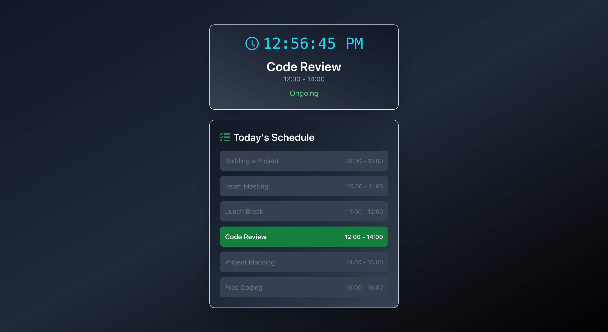

# TaskBeacon 🕒

**TaskBeacon** is a modern task management app built with **Next.js**. It helps you stay on top of your daily schedule with real-time updates and a visually appealing interface.

## Features ✨

- **Live Digital Clock**: Displays the current time with a dynamic update every second.
- **Current Task Highlighting**: Shows the ongoing task and its time slot.
- **Daily Schedule Overview**: Lists all tasks for the day with distinct styles for past, current, and upcoming tasks.
- **Responsive Design**: Optimized for both desktop and mobile devices.
- **Dark Theme**: Aesthetic and easy on the eyes, using a gradient background and subtle shadows.

---

## Screenshots 📸

### **Home Page - Schedule Overview**

---

## Tech Stack 🛠️

- **Framework**: [Next.js](https://nextjs.org/)
- **Styling**: [Tailwind CSS](https://tailwindcss.com/)
- **UI Components**: Custom components inspired by [shadcn](https://shadcn.dev/)

---

## Contributing 🤝

We welcome contributions! If you'd like to contribute:

1. Fork the repository.
2. Create a new branch for your feature or bug fix.
3. Submit a pull request with detailed changes.

---

## License 📜

This project is licensed under the MIT License. See the [LICENSE](./LICENSE) file for details.

---

## Author 👩‍💻

**Phil Wamba**

